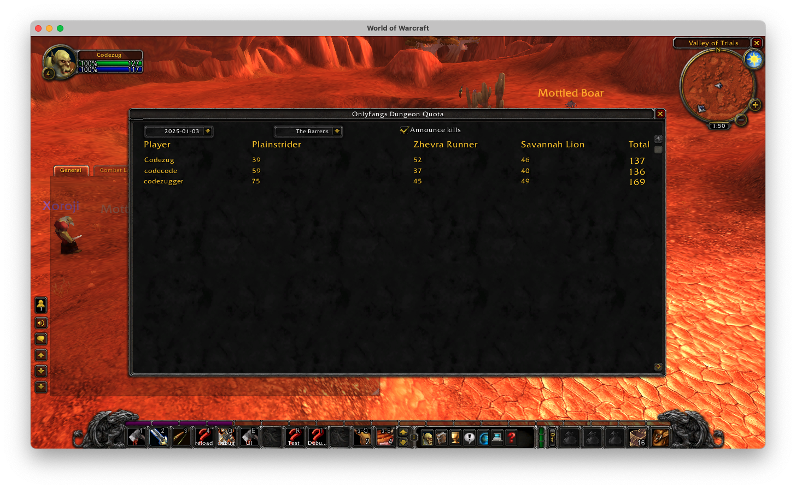
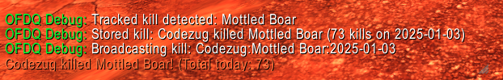

# OnlyFangs Dungeon Quota

**This is a work in progress.**

A World of Warcraft addon that tracks the number of successful dungeon runs for each guild member, on a daily basis.

- [ ] Currently we are only tracking a few mobs in Durotar and The Barrens for testing purposes. 
- [ ] Next steps are to integrate this tracking with the guild chat addon communication api, and have other players be able to see your kills.
- [ ] Finally, we'd create a set of dungeons to track, and then we'd be able to create a leaderboard / quota system that other guildies can see.

## Commands

- `/ofdqui` - Toggle the main window
- `/ofdq clear` - Clear all stored data
- `/ofdq dump` - Debug dump of current data

## Using the Addon

1. Open the main window with `/ofdqui`
2. Use the dropdowns to select:
   - Date: View data from different days
   - Zone: Switch between different zones (Durotar, The Barrens)
3. Toggle "Announce kills" checkbox to enable/disable kill announcements in emote chat.

## Currently Tracked Mobs

### Durotar
- Mottled Boar
- Hare
- Adder

### The Barrens
- Plainstrider
- Zhevra Runner
- Savannah Lion

## Screenshots

